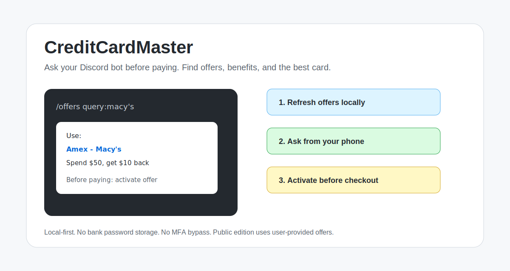
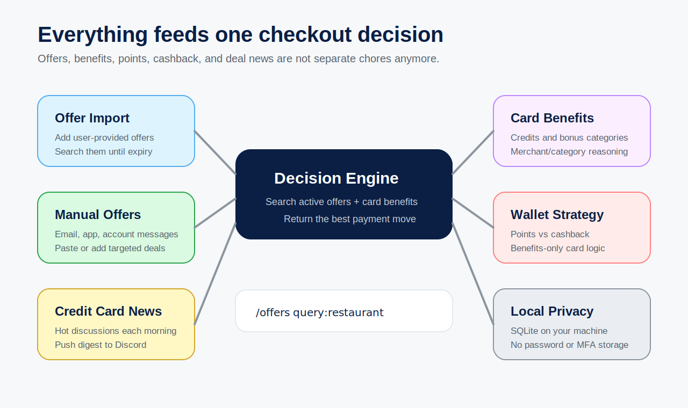
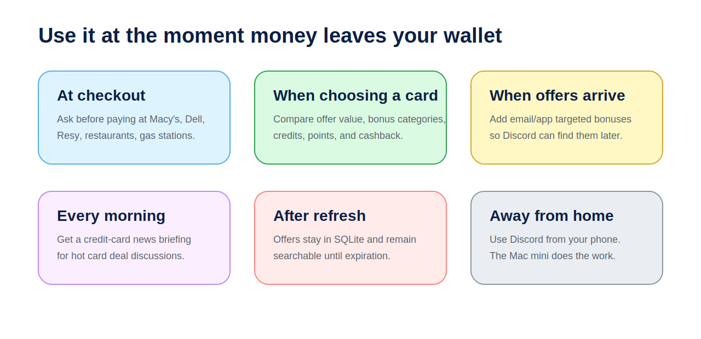
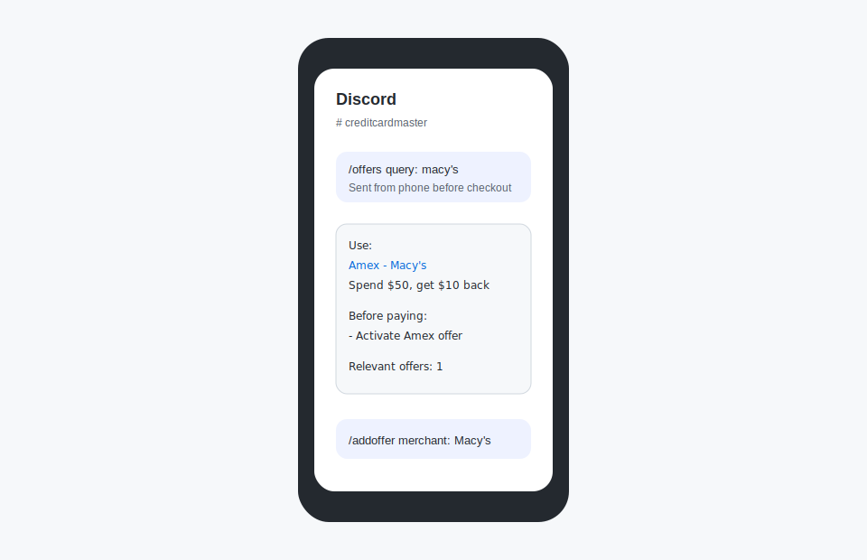
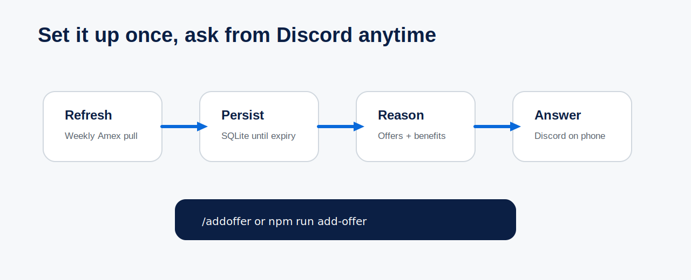

<p align="right"><a href="README.zh-CN.md">中文</a></p>

<p align="center">
  
</p>

# CreditCardMaster

### 💳 Find the best card. Maximize every purchase.

CreditCardMaster is a local-first credit card decision assistant for checkout moments.



## ✨ What It Does



## 🛒 Use Cases



## 🤖 Mobile First

Ask from Discord when you are standing at checkout, ordering food, booking travel, or shopping online.



```text
/offers query:macy's
/offers query:restaurant
/offers query:gas
/offers query:今晚吃饭
/pasteoffer issuer:amex text:<copied offer text>
/rakuten query:macy's
```

## 🔁 Add Once, Search Later



## 🧩 Modules

| Module | Detail |
| --- | --- |
| 💬 Discord assistant | [docs/modules/discord-assistant.md](docs/modules/discord-assistant.md) |
| 🔁 Offer import | [docs/modules/offer-refresh.md](docs/modules/offer-refresh.md) |
| 🧰 Custom importer template | [docs/modules/custom-importer-template.md](docs/modules/custom-importer-template.md) |
| 💳 Card benefits | [docs/modules/card-benefits.md](docs/modules/card-benefits.md) |
| 🔎 Local RAG retrieval | [docs/modules/rag.md](docs/modules/rag.md) - Python LangChain + FAISS + Ollama embeddings |
| 🐍 Python runtime | [docs/modules/python-runtime.md](docs/modules/python-runtime.md) |
| 🛍️ Shopping portals | [docs/modules/shopping-portals.md](docs/modules/shopping-portals.md) |
| 🎯 Manual offers | [docs/modules/manual-offers.md](docs/modules/manual-offers.md) |
| 📰 Credit card news | [docs/modules/doctor-of-credit-monitor.md](docs/modules/doctor-of-credit-monitor.md) |

## 🚀 Quick Start

```bash
npm install
cp .env.example .env
npm run init-db
npm run doctor
```

Start with [offer import](docs/modules/offer-refresh.md), then connect the [Discord assistant](docs/modules/discord-assistant.md).

## 🧪 Public Edition

The public edition does not automate bank login or bank-page scraping. It works with offers you add or import yourself, plus card benefits, points, cashback, wallet strategy, and the credit-card news monitor.

```bash
npm run public:check
npm run test:public
```

## 🔒 Local First

No bank password storage. No MFA bypass. No bank browser automation in the public edition.

The primary database runs locally. When Discord is enabled, slash-command queries and bot responses are transmitted through Discord and are subject to Discord's privacy and retention practices.

## 📄 License

MIT
