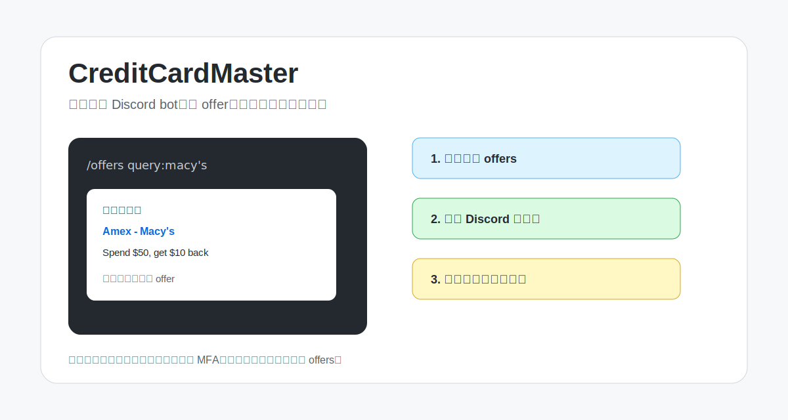
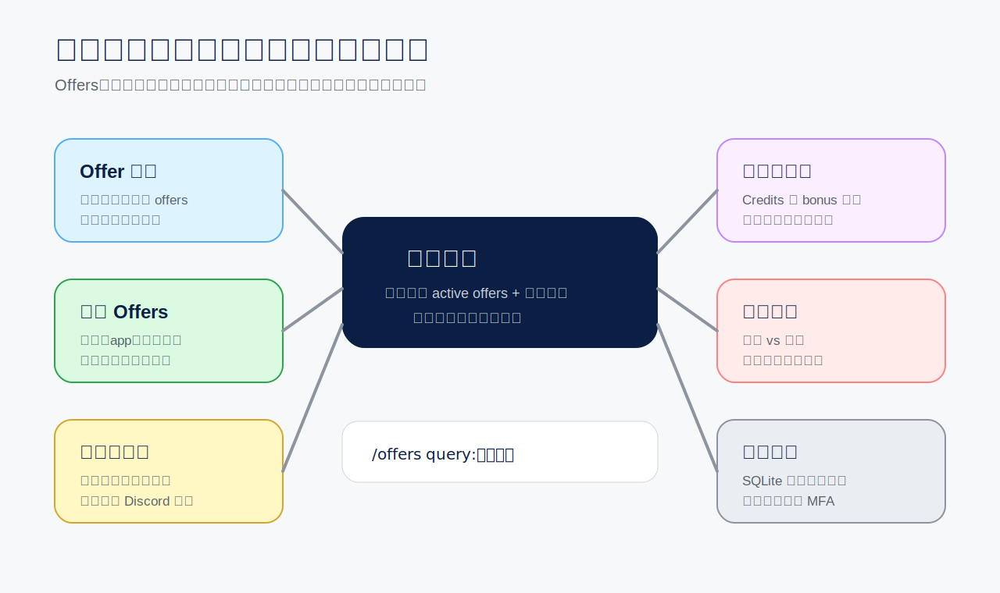
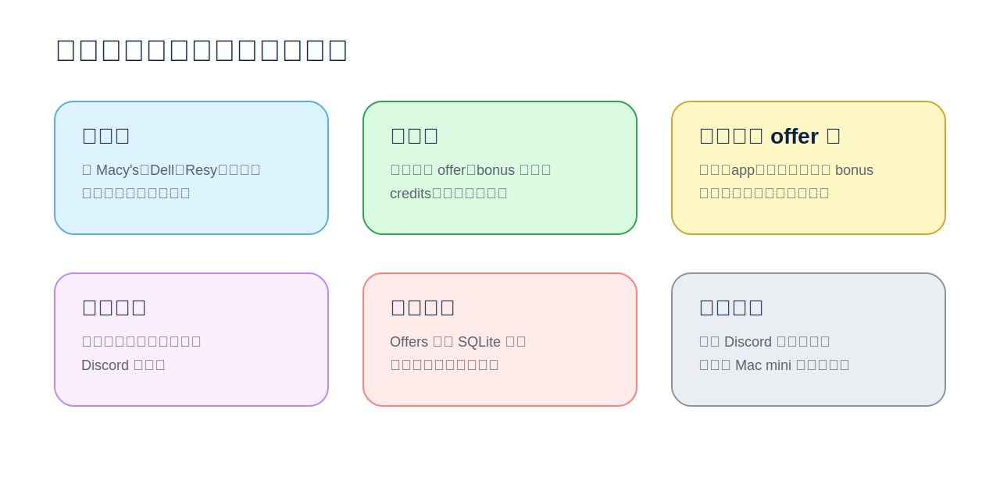
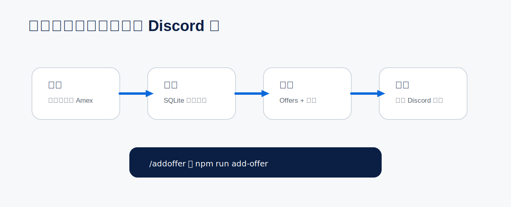

<p align="right"><a href="README.md">English</a></p>

<p align="center">
  
</p>

# CreditCardMaster

### 💳 找到最合适的卡，让每次付款都更划算。

CreditCardMaster 是一个本地优先的信用卡付款决策助手。



## ✨ 它能做什么



## 🛒 使用场景



## 🤖 手机优先

付款、吃饭、旅行、网购前，在手机 Discord 里直接问。


```text
/offers query:macy's
/offers query:restaurant
/offers query:gas
/offers query:今晚吃饭
/pasteoffer issuer:amex text:<复制的 offer 文本>
/rakuten query:macy's
```

## 🔁 添加一次，之后随时搜



## 🧩 模块文档

| 模块 | 详情 |
| --- | --- |
| 💬 Discord 查询助手 | [docs/modules/discord-assistant.md](docs/modules/discord-assistant.md) |
| 🔁 Offer 导入 | [docs/modules/offer-refresh.md](docs/modules/offer-refresh.md) |
| 🧰 自定义导入模板 | [docs/modules/custom-importer-template.md](docs/modules/custom-importer-template.md) |
| 💳 信用卡权益 | [docs/modules/card-benefits.md](docs/modules/card-benefits.md) |
| 🔎 本地 RAG 检索 | [docs/modules/rag.md](docs/modules/rag.md) - Python LangChain + FAISS + Ollama embeddings |
| 🐍 Python 运行时 | [docs/modules/python-runtime.md](docs/modules/python-runtime.md) |
| 🛍️ 购物返现入口 | [docs/modules/shopping-portals.md](docs/modules/shopping-portals.md) |
| 🎯 手动 Offers | [docs/modules/manual-offers.md](docs/modules/manual-offers.md) |
| 📰 信用卡新闻 | [docs/modules/doctor-of-credit-monitor.md](docs/modules/doctor-of-credit-monitor.md) |

## 🚀 快速开始

```bash
npm install
cp .env.example .env
npm run init-db
npm run doctor
```

先看 [Offer 导入](docs/modules/offer-refresh.md)，再接入 [Discord 查询助手](docs/modules/discord-assistant.md)。

## 🧪 开源版

公开版不自动登录银行，也不自动读取银行页面。它使用你自己添加或导入的 offers，并结合信用卡权益、积分、返现、钱包策略和信用卡新闻监控给出付款建议。

```bash
npm run public:check
npm run test:public
```

## 🔒 本地优先

不保存银行密码。不绕过 MFA。公开版不包含银行浏览器自动化。

主数据库在本地运行。启用 Discord 后，slash command 查询和机器人回复会经过 Discord，并受 Discord 的隐私与留存规则约束。

## 📄 License

MIT
